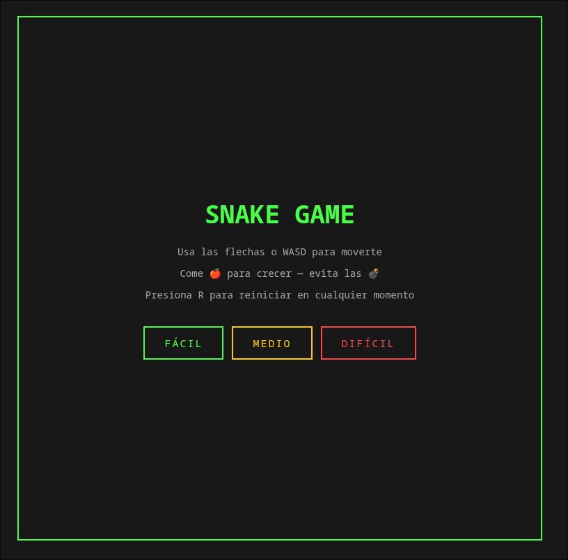
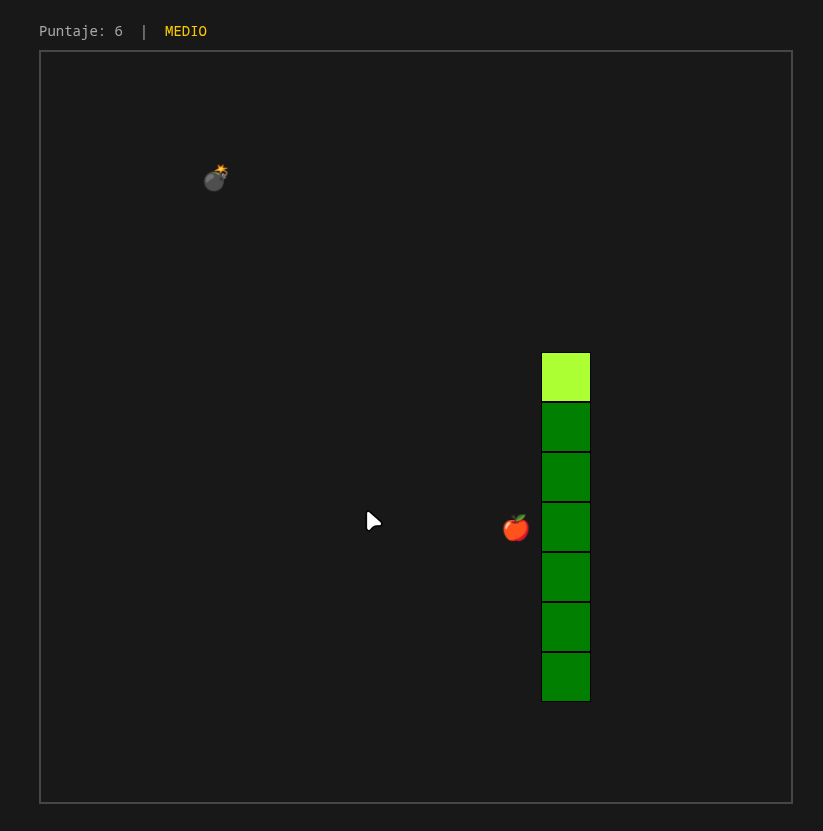

# Snake Game 🐍

Juego clásico de Snake implementado con React (vía CDN) y JSX en el navegador usando Babel, sin herramientas de build.

## Screenshots

### Pantalla de Inicio


### Jugando



## Cómo correr el proyecto

### Requisitos
- Un navegador moderno (Chrome, Firefox, Edge)
- No requiere instalación ni servidor

### Instalación

```bash
git clone https://github.com/TuUsuario/snake-game.git
cd snake-game
```

Abrí `index.html` directamente en tu navegador.

### Estructura del proyecto

```
.
├── index.html   # Todo el juego — componentes React, lógica y estilos
└── README.md
```

## Cómo jugar

| Acción | Teclas |
|--------|--------|
| Moverse | `↑ ↓ ← →` o `W A S D` |
| Reiniciar | `R` |
| Pausar | 'P' |

- Elegí una dificultad al inicio: **Fácil**, **Medio** o **Difícil**
- Comé las 🍎 para crecer y sumar puntos
- Evitá las 💣 — explotarás (y perderás)
- No choqués con las paredes ni con vos mismo

## Componentes React

| Componente | Responsabilidad |
|------------|-----------------|
| `App` | Contenedor raíz |
| `Game` | Estado principal del juego y loop |
| `Segment` | Cada bloque de la serpiente |
| `Food` | Manzana comestible |
| `Bomb` | Manzana bomba |
| `Score` | Puntaje y dificultad actual |

## Funcionalidades implementadas

| Funcionalidad | Descripción |
|---------------|-------------|
| Movimiento | Flechas y WASD |
| Colisión con pared | Game over inmediato |
| Colisión consigo misma | Game over con delay de 1s para visualizar |
| Colisión con bomba | Game over con delay de 1s |
| Comida aleatoria | Aparece en posición libre del tablero |
| Bombas | Aparecen tras comer la primera manzana, se reubican con cada manzana |
| Puntaje | +1 por cada manzana, se muestra durante el juego y al morir |
| Dificultad | Fácil (250ms), Medio (150ms), Difícil (80ms) |
| Cabeza diferenciada | Color distinto para identificar la dirección |
| Pantalla de inicio | Instrucciones y selección de dificultad |
| Pantalla de Game Over | Razón de muerte y puntaje final |
| Reinicio | Tecla R en cualquier momento |
| Pausa | Tecla P en cualquier momento |

## Detalles técnicos

- Todo el código vive en un único `index.html` — sin Vite, Webpack ni Create React App
- El estado del juego se maneja con `useState`; el loop de movimiento con `setInterval` dentro de `useEffect`
- La posición de la comida se lee desde un `useRef` dentro del interval para evitar closures desactualizados
- La serpiente es un array de coordenadas `{x, y}`; crecer significa no descartar el último segmento en el tick donde se come
- Las bombas y manzanas usan `randomPos()` con lista de exclusión para nunca solaparse entre sí ni con la serpiente

## 👨‍💻 Autor

Marcelo Detlefsen - 24554